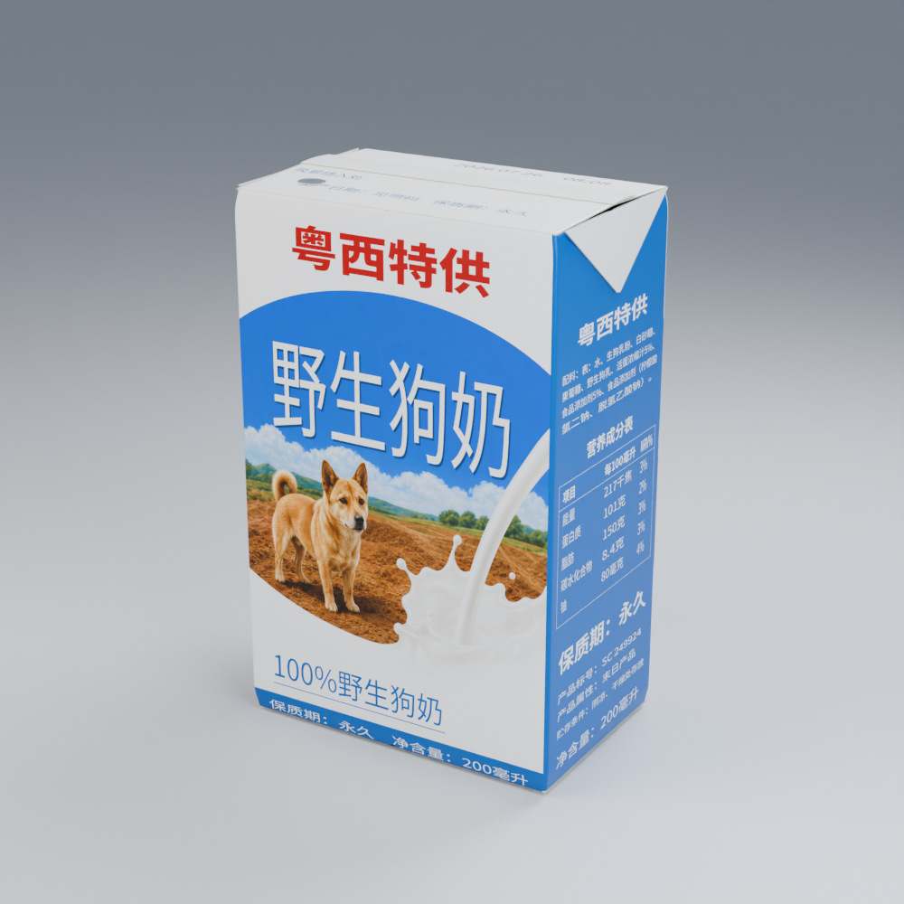
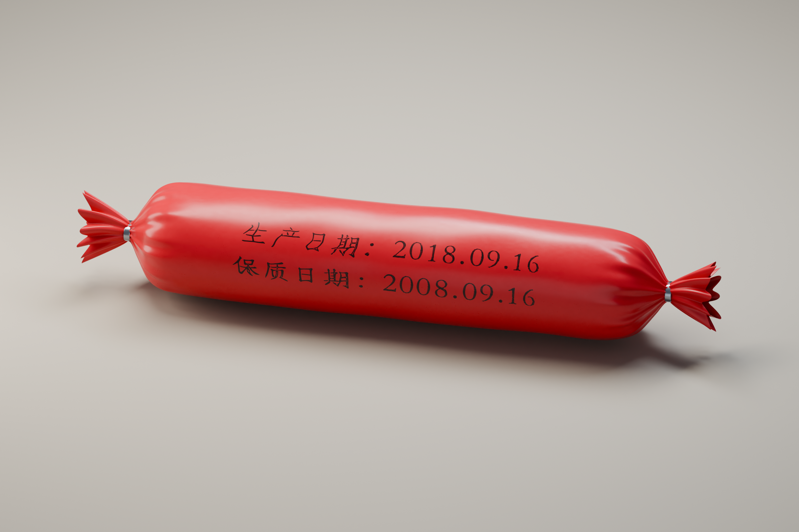
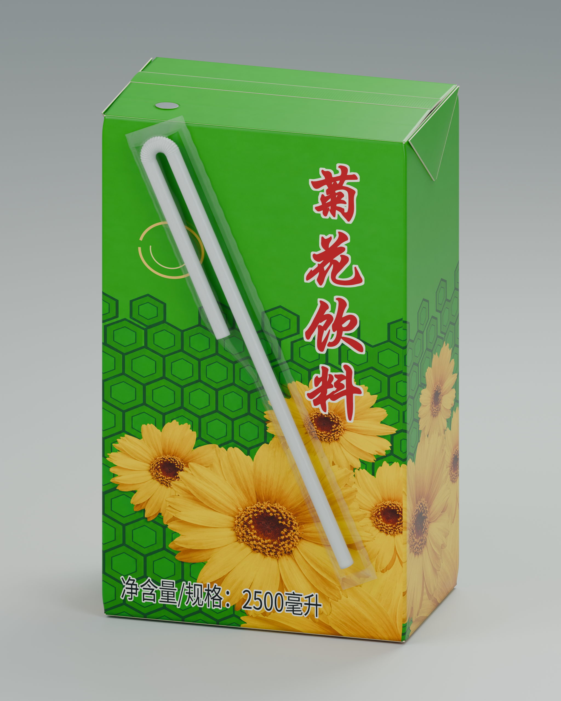

# shenqi-models

三个网络梗图包装的 Blender 模型：**野生狗奶、春秋肠、菊花饮料**。

提供可编辑的 Blender 源文件、自包含 GLB 和实际渲染预览，采用 [MIT License](LICENSE)。

| 野生狗奶 | 春秋肠 | 菊花饮料 |
| :---: | :---: | :---: |
|  |  |  |
| [模型与说明](models/wild-dog-milk) | [模型与说明](models/chunqiu-sausage) | [模型与说明](models/chrysanthemum-drink) |

## 下载与使用

1. 点击模型目录中的 `model.blend` 或 `model.glb`，再点击 **Download raw file** 下载。也可以从仓库右上方 **Code → Download ZIP** 下载全部文件。
2. 使用 **Blender 5.0.1 或兼容版本**打开 `.blend`。贴图已内嵌，不需要手工查找或重新连接。
3. 其他 3D 工具可导入 `.glb`。它包含模型、UV 和贴图；Blender 工程保留更完整的程序化材质、摄影棚和相机。

```bash
git clone https://github.com/Wangnov/shenqi-models.git
```

文件直接存储在 Git 中，不需要 Git LFS。渲染设备默认设为 CPU，可自行切换到本机 GPU。贴图可通过 Blender 图像编辑器另存导出。

## 目录

```text
models/
  wild-dog-milk/          # 野生狗奶
  chunqiu-sausage/        # 春秋肠
  chrysanthemum-drink/    # 菊花饮料
    model.blend          # 可编辑源文件，贴图内嵌
    model.glb            # 自包含交换格式
    README.md            # 各模型规格与说明
docs/
  previews/              # 实际模型渲染
  REFERENCES.md          # 参考来源与重绘说明
LICENSE
SHA256SUMS               # 发布文件校验值
```

`.blend` 是本仓库的可编辑源文件。仓库不包含本地制作日志、缓存、旧版本、重复的外部贴图或网络原始截图。

## 制作与许可

模型使用 Blender 制作，部分插画及字形使用 Image 2 按参考图重绘。未展示的包装面和结构经过补建，尺寸是比例估算；贴图输出分辨率不等同于参考图或重绘图的原始分辨率。详见 [参考资料](docs/REFERENCES.md)。

本仓库提供的模型和渲染采用 **MIT** 许可证。参考照片及原包装设计、商标等第三方权利仍归各自权利人；本项目不主张拥有或重新授权这些第三方权利。字体排版使用思源黑体，仓库不分发字体文件。
